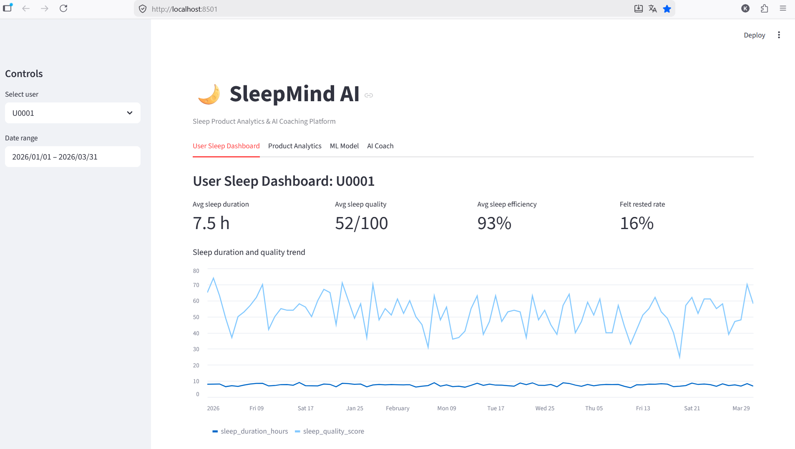
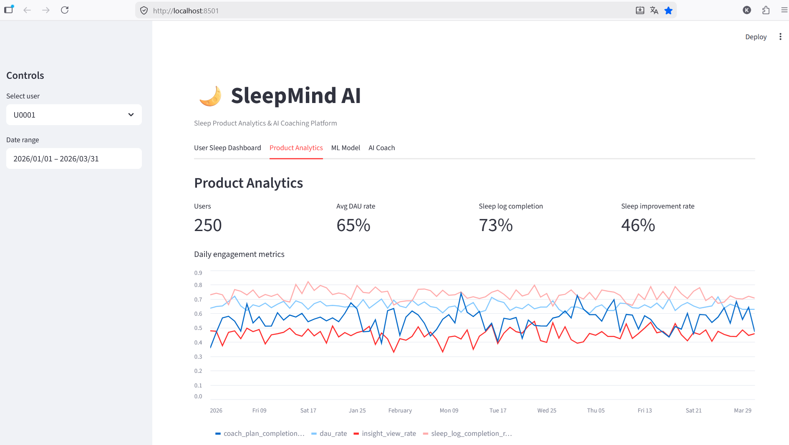
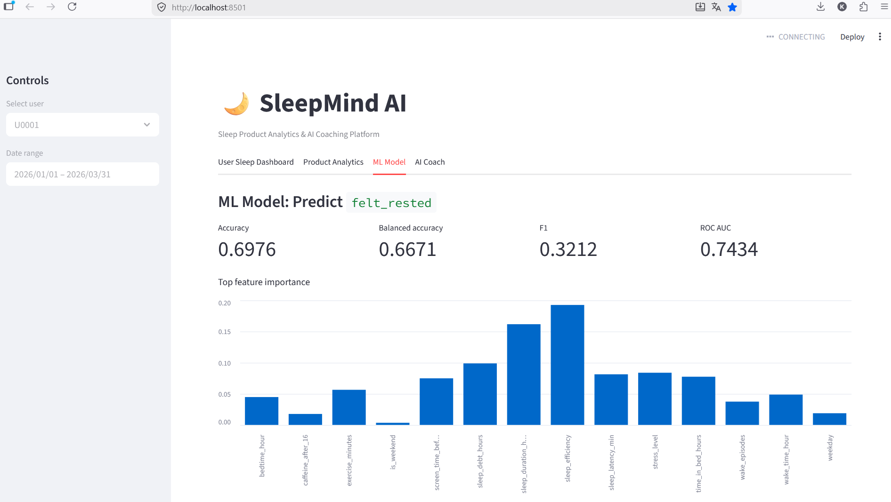
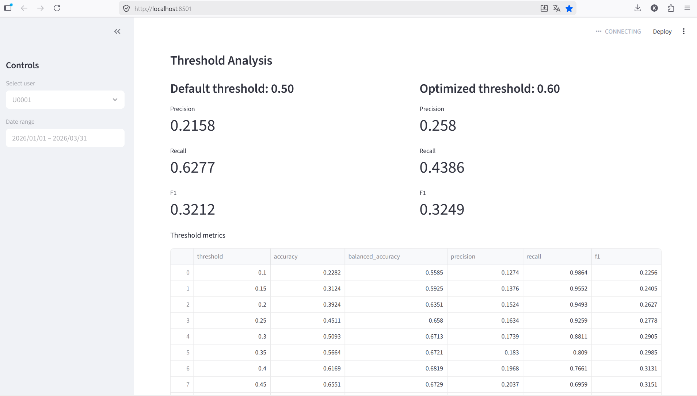
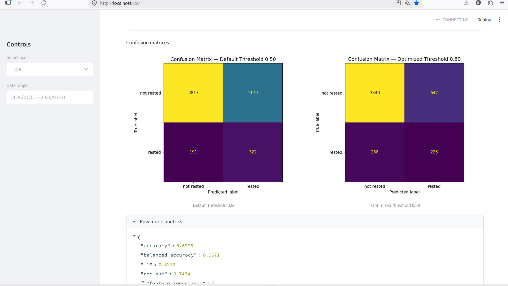

# SleepMind AI

**Sleep Product Analytics & AI Coaching Platform**

SleepMind AI is a portfolio project that combines sleep behavior analytics, product metrics, machine learning, threshold analysis, and a rule-based AI coaching assistant.

The project is designed as a realistic MVP of a sleep-tech / digital health product.

## Project Highlights

- Built an end-to-end sleep analytics MVP: data generation, product metrics, ML model, AI coach, and dashboard.
- Simulated a realistic sleep-tech product dataset with 22,500 user-day records.
- Designed product analytics metrics: DAU rate, sleep log completion, insight view rate, coaching plan completion, and sleep improvement rate.
- Trained a Random Forest model to predict whether a user is likely to feel rested.
- Evaluated the model under class imbalance using balanced accuracy, ROC AUC, precision, recall, F1, threshold analysis, and confusion matrices.
- Built a Streamlit dashboard for user sleep trends, product analytics, ML evaluation, and coaching recommendations.
- Added a safe rule-based AI sleep coach with wellness-oriented recommendations and no medical diagnosis claims.

## Project Goal

Many users track their sleep, but raw sleep numbers are often hard to interpret.

SleepMind AI helps answer questions such as:

- How stable is the user's sleep routine?
- Is sleep quality improving over time?
- Which habits are associated with worse sleep?
- Do users engage with insights and coaching recommendations?
- Can we predict whether a user will feel rested?

## Key Features

- Synthetic sleep app dataset generation
- User sleep dashboard
- Product analytics metrics
- ML model for predicting `felt_rested`
- Feature importance analysis
- Threshold analysis and confusion matrices
- Rule-based AI sleep coach
- Streamlit dashboard
- Product case study

## Dataset

The MVP uses synthetic user-day sleep data. Each row represents one user on one day.

Dataset size:

- 22,500 rows
- 250 users
- 90 days

Main columns:

- `user_id`
- `date`
- `bedtime_hour`
- `wake_time_hour`
- `sleep_duration_hours`
- `time_in_bed_hours`
- `sleep_latency_min`
- `wake_episodes`
- `caffeine_after_16`
- `screen_time_before_bed_min`
- `stress_level`
- `exercise_minutes`
- `sleep_efficiency`
- `sleep_quality_score`
- `felt_rested`
- `app_opened`
- `sleep_log_completed`
- `insight_viewed`
- `coach_message_sent`
- `plan_completed`

## Product Analytics

The project calculates product and engagement metrics:

- DAU rate
- Sleep log completion rate
- Insight view rate
- Coaching plan completion rate
- Average sleep duration
- Average sleep quality
- Sleep improvement rate

These metrics imitate how a product analyst would evaluate a sleep coaching app.

## ML Task

The machine learning task is binary classification.

Target: `felt_rested`

The model predicts whether a user is likely to feel rested based on sleep and behavior features.

Features include:

- sleep duration
- sleep efficiency
- sleep latency
- wake episodes
- stress level
- screen time before bed
- caffeine after 16:00
- exercise minutes
- weekday / weekend
- sleep debt

## Model

Baseline model:

- Random Forest Classifier

Current model metrics:

| Metric | Value |
|---|---:|
| Accuracy | 0.6976 |
| Balanced accuracy | 0.6671 |
| F1 | 0.3212 |
| ROC AUC | 0.7434 |

The target is imbalanced, so balanced accuracy and ROC AUC are more informative than accuracy alone.

Top important features:

1. sleep efficiency
2. sleep duration hours
3. sleep debt hours
4. stress level
5. sleep latency minutes

## Model Evaluation: Threshold Analysis

The target variable `felt_rested` is imbalanced, so accuracy alone is not enough to evaluate the model.

The model was evaluated with two probability thresholds:

| Threshold | Accuracy | Balanced Accuracy | Precision | Recall | F1 |
|---|---:|---:|---:|---:|---:|
| 0.50 | 0.6976 | 0.6671 | 0.2158 | 0.6277 | 0.3212 |
| 0.60 | 0.7922 | 0.6382 | 0.2580 | 0.4386 | 0.3249 |

The optimized threshold `0.60` slightly improves F1 and precision, but reduces recall.

This means the model becomes more conservative: it makes fewer positive predictions for `felt_rested = 1`, but those predictions are more reliable.

For a sleep coaching product, the threshold choice depends on the product goal:

- lower threshold: find more potentially rested users, but with more false positives;
- higher threshold: make fewer but more confident positive predictions.

## AI Sleep Coach

The coaching assistant is rule-based in the MVP.

It analyzes the last 7 days of sleep data and generates:

- weekly sleep insight;
- trend comparison with the previous week;
- suggested next steps;
- safety disclaimer.

The coach does not provide medical diagnoses.

## Dashboard Screenshots

### User Sleep Dashboard

### Product Analytics

### ML Model Metrics

### ML Threshold Analysis

### ML Confusion Matrices

## Project Structure

- `app/streamlit_app.py` — Streamlit dashboard
- `src/data_generation.py` — synthetic sleep app data generation
- `src/metrics.py` — product analytics metrics
- `src/features.py` — feature engineering
- `src/model.py` — ML model training
- `src/evaluation.py` — threshold analysis and confusion matrices
- `src/coach.py` — rule-based sleep coaching assistant
- `scripts/run_pipeline.py` — end-to-end project pipeline
- `reports/product_case_study.md` — product case study
- `reports/model_metrics.json` — model metrics
- `reports/evaluation_summary.json` — threshold evaluation summary
- `reports/threshold_metrics.csv` — threshold metrics table

## How to Run

Clone the repository:

`git clone https://github.com/kva99kva-eng/sleepmind-ai.git`

Go to the project folder:

`cd sleepmind-ai`

1. Create virtual environment:

`python -m venv .venv`

2. Activate virtual environment on Windows PowerShell:

`.\.venv\Scripts\Activate.ps1`

3. Install dependencies:

`pip install -r requirements.txt`

4. Run the full pipeline:

`python scripts\run_pipeline.py`

5. Run the Streamlit dashboard:

`streamlit run app\streamlit_app.py`

If Streamlit is not recognized:

`python -m streamlit run app\streamlit_app.py`

## Dashboard Tabs

The Streamlit app contains four tabs:

1. **User Sleep Dashboard** — individual sleep trends and recent sleep logs.
2. **Product Analytics** — engagement metrics and user-level summaries.
3. **ML Model** — model quality metrics, feature importance, threshold analysis, and confusion matrices.
4. **AI Coach** — personalized weekly sleep insight and recommendations.

## Limitations

This project is for portfolio and educational purposes.

Important limitations:

- The dataset is synthetic.
- The model is not validated on real clinical or wearable data.
- The AI coach is rule-based.
- The project does not diagnose, treat, or prevent sleep disorders.
- Recommendations are wellness-oriented and not medical advice.

## Future Work

Planned improvements:

- Add cohort analysis.
- Add retention curves.
- Add A/B test simulation.
- Add real wearable or sleep dataset.
- Add Sleep-EDF EEG-based sleep staging module.
- Improve model evaluation for imbalanced classification.

## Portfolio Positioning

This project demonstrates:

- product analytics;
- sleep behavior analysis;
- feature engineering;
- machine learning;
- model evaluation;
- threshold analysis;
- Streamlit prototyping;
- safe AI assistant design;
- healthtech / sleeptech product thinking.

