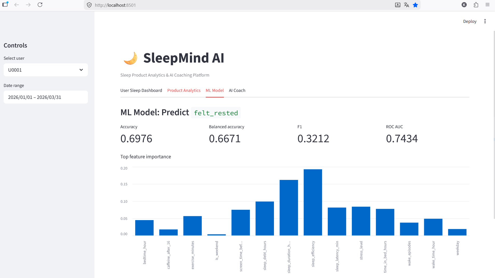

# SleepMind AI

**Sleep Product Analytics & AI Coaching Platform**

SleepMind AI is a portfolio project that combines sleep behavior analytics, product metrics, machine learning, and a rule-based AI coaching assistant.

The project is designed as a realistic MVP of a sleep-tech / digital health product.

## Project Goal

Many users track their sleep, but raw sleep numbers are often hard to interpret.

SleepMind AI helps answer questions such as:

- How stable is the user's sleep routine?
- Is sleep quality improving over time?
- Which habits are associated with worse sleep?
- Do users engage with insights and coaching recommendations?
- Can we predict whether a user will feel rested?

## Key Features

- Synthetic sleep app dataset generation
- User sleep dashboard
- Product analytics metrics
- ML model for predicting `felt_rested`
- Feature importance analysis
- Rule-based AI sleep coach
- Streamlit dashboard

## Dataset

The MVP uses synthetic user-day sleep data.

Each row represents one user on one day.

Main columns:

- `user_id`
- `date`
- `bedtime_hour`
- `wake_time_hour`
- `sleep_duration_hours`
- `time_in_bed_hours`
- `sleep_latency_min`
- `wake_episodes`
- `caffeine_after_16`
- `screen_time_before_bed_min`
- `stress_level`
- `exercise_minutes`
- `sleep_efficiency`
- `sleep_quality_score`
- `felt_rested`
- `app_opened`
- `sleep_log_completed`
- `insight_viewed`
- `coach_message_sent`
- `plan_completed`

Dataset size:

```text
22,500 rows
250 users
90 days

Product Analytics

The project calculates product and engagement metrics:

DAU rate
Sleep log completion rate
Insight view rate
Coaching plan completion rate
Average sleep duration
Average sleep quality
Sleep improvement rate

These metrics imitate how a product analyst would evaluate a sleep coaching app.

ML Task

The machine learning task is binary classification:

Target: felt_rested

The model predicts whether a user is likely to feel rested based on sleep and behavior features.

Features include:

sleep duration
sleep efficiency
sleep latency
wake episodes
stress level
screen time before bed
caffeine after 16:00
exercise minutes
weekday/weekend
sleep debt
Model

Baseline model:

Random Forest Classifier

Current model metrics:

Accuracy: 0.6976
Balanced accuracy: 0.6671
F1: 0.3212
ROC AUC: 0.7434

The target is imbalanced, so balanced accuracy and ROC AUC are more informative than accuracy alone.

Top important features:

sleep_efficiency
sleep_duration_hours
sleep_debt_hours
stress_level
sleep_latency_min
AI Sleep Coach

The coaching assistant is rule-based in the MVP.

It analyzes the last 7 days of sleep data and generates:

weekly sleep insight
trend comparison with the previous week
suggested next steps
safety disclaimer

The coach does not provide medical diagnoses.

Project Structure
sleepmind-ai/
├── app/
│   └── streamlit_app.py
├── data/
│   ├── raw/
│   ├── processed/
│   └── synthetic/
├── reports/
│   ├── model_metrics.json
│   └── sleep_model.joblib
├── scripts/
│   └── run_pipeline.py
├── src/
│   ├── __init__.py
│   ├── coach.py
│   ├── data_generation.py
│   ├── features.py
│   ├── metrics.py
│   └── model.py
├── .gitignore
├── README.md
└── requirements.txt
How to Run
1. Create virtual environment

Windows PowerShell:

python -m venv .venv
.\.venv\Scripts\Activate.ps1
2. Install dependencies
pip install -r requirements.txt
3. Run the full pipeline
python scripts\run_pipeline.py

This command generates data, calculates product metrics, trains the model, and saves model metrics.

4. Run the Streamlit dashboard
streamlit run app\streamlit_app.py

If Streamlit is not recognized:

python -m streamlit run app\streamlit_app.py
Dashboard Tabs

The Streamlit app contains four tabs:

User Sleep Dashboard
Individual sleep trends and recent sleep logs.
Product Analytics
Engagement metrics and user-level summaries.
ML Model
Model quality metrics and feature importance.
AI Coach
Personalized weekly sleep insight and recommendations.
Limitations

This project is for portfolio and educational purposes.

Important limitations:

The dataset is synthetic.
The model is not validated on real clinical or wearable data.
The AI coach is rule-based.
The project does not diagnose, treat, or prevent sleep disorders.
Recommendations are wellness-oriented and not medical advice.
Next Steps

Planned improvements:

Add cohort analysis
Add retention curves
Add A/B test simulation
Add real wearable or sleep dataset
Add Sleep-EDF EEG-based sleep staging module
Improve model evaluation for imbalanced classification
Add screenshots to README
Portfolio Positioning

This project demonstrates:

product analytics
sleep behavior analysis
feature engineering
machine learning
model evaluation
Streamlit prototyping
safe AI assistant design
healthtech / sleeptech product thinking
'@ | Set-Content -Encoding UTF8 README.md

## Dashboard Screenshots

### User Sleep Dashboard


### Product Analytics


### ML Model


